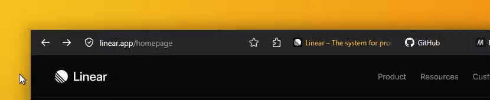
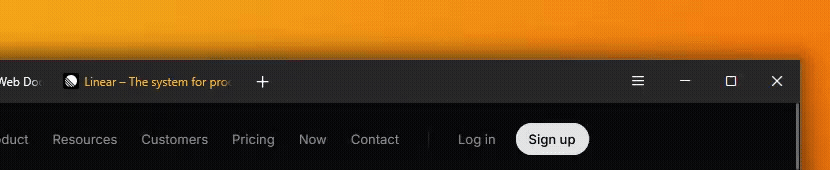

# FoxOne

**A minimalistic one-line Firefox theme**
> Ready for **Nova**. Tested and stable on Firefox 152+ with `browser.nova.enabled`
> 

 

### Installation
>
>1. Download [`userChrome.css`](https://github.com/Firnschnee/FoxOne/blob/main/userChrome.css) and [`userContent.css`](https://github.com/Firnschnee/FoxOne/blob/main/userContent.css)
>
>2. Go to **`about:config`** in FireFox. Search for **`toolkit.legacyUserProfileCustomizations.stylesheets`** and set it to **`true`**.
>
>3. Find your profile folder: In Firefox, go to `about:support` and click **Open Profile Folder**.
>
>4. Create a `chrome` folder inside your profile folder if it doesn't exist, then copy these files into it:
>
>- [`userChrome.css`](https://github.com/Firnschnee/FoxOne/blob/main/userChrome.css) - browser UI styling
>- [`userContent.css`](https://github.com/Firnschnee/FoxOne/blob/main/userContent.css) - new tab / home page colors
>
>5. Restart Firefox - The theme applies on restart.
>   
>6. FoxOne includes a built-in Gruvbox inspired Dark color theme that activates automatically in dark mode. No separate extension needed.

### Features

Dynamic URL bar with hover-reveal Icons

 

Dynamic tabs and two addons pinned by the hamburger, revealed on hover.

 

 

Floating Find Bar. Adapted from [LittleFox](https://github.com/biglavis/LittleFox)

#### Customisation

> Running classic (pre-Nova) Firefox?
> From release 3.0 onward, FoxOne targets the Nova UI. The stylesheet is dual-written (Proton & Nova) and should still work, but it is no longer tested. For a known-good classic build, use the 2.3 release.

> If you use a different system theme or want light mode, the color theme section in userChrome.css only applies inside @media (prefers-color-scheme: dark) and won't interfere.

All configuration lives in the `:root` block at the top of `userChrome.css`.

#### Color Palette

| Variable | Default | Description |
|---|---|---|
| `--uc-color-base` | `#282828` | Main background (toolbar, frame) |
| `--uc-color-surface` | `#3c3836` | Elevated surfaces (panels, popups) |
| `--uc-color-accent` | `#fabd2f` | Accent color (active tab, focus ring) |
| `--uc-color-text` | `#FFFFFF` | Primary text |
| `--uc-color-hover` | `#7c6f64` | Hover / highlight backgrounds |

##### Layout

| Variable | Default | Description |
|---|---|---|
| `--uc-border-radius` | `8px` | Global corner radius |
| `--uc-status-panel-spacing` | `12px` | Statuspanel distance from window border (`0` = corner) |
| `--uc-urlbar-min-width` | `min(35vw, 630px)` | URL bar default width (px ceiling caps growth on ultrawide/4K) |
| `--uc-urlbar-max-width` | `min(50vw, 900px)` | URL bar width on focus (px ceiling caps growth on ultrawide/4K) |

#### Tabs

| Variable | Default | Description |
|---|---|---|
| `--uc-active-tab-width` | `clamp(100px, 30vw, 190px)` | Active tab width (narrow-window default; widened to `…250px` once the window reaches ~1710 *physical* px, i.e. ~2/3 of WQHD — the threshold is tiered by `resolution`/dppx so it fires at the same physical size under DPI scaling) |
| `--uc-inactive-tab-width` | `clamp(100px, 20vw, 120px)` | Inactive tab width (ceiling kept below the active one so the active tab stays visibly larger; widened to `…200px` at the same ~1710 physical-px threshold) |
| `--uc-tab-min-width` | `76px` | Tab minimum width (Firefox default: `76px`, lower e.g. `36px` to fit more before overflow) |
| `--uc-tab-hover-text` | `#ffda85` | Inactive tab title color on hover |

### Window Controls

| Variable | Default | Description |
|---|---|---|
| `--uc-window-buttons-width` | `138px` | Window control button width. Fallback only: on non-macOS the hamburger auto-tracks the real control box via CSS anchor positioning; used on macOS and on Firefox builds without anchor support (auto `0px` on macOS) |
| `--uc-hamburger-width` | `44px` | Hamburger menu reserved width |
| `--uc-toolbar-button-width` | `36px` | Extension button width (per button) |
| `--uc-newtab-width` | `36px` | Standalone new-tab button width (`0` if removed) |
| `--uc-drag-space` | `40px` | Gap for window dragging |

#### Visibility Toggles

| Variable | Default | Description |
|---|---|---|
| `--uc-show-context-splitview` | `none` | Context menu "Open Link in Split View" (`none` = hidden, `-moz-box` = visible) |
| `--uc-show-all-tabs-button` | `none` | All-tabs button (`none` = hidden, `-moz-box` = visible) |
| `--uc-autohide-nav-buttons` | `0` | Navigation buttons auto-hide (`0` = always visible, `1` = reveal on hover and focus, `2` = reveal on hover only) |
| `--uc-hide-nav-buttons` | `0` | Remove navigation buttons entirely (`1` = hide, `0` = show) |
| `--uc-hide-urlbar-buttons` | `0` | Hide URL-bar clutter icons — shield (tracking protection), reader mode, translations, bookmark star, add-to-taskbar (`1` = hide all, `0` = default reveal) |
| `--uc-hide-extension-icons` | `0` | Hide pinned toolbar extension icons, reveal them on hamburger hover (`1` = hide + hover-reveal, `0` = always show) |

#### Adaptive Tab Bar Colour

FoxOne is compatible with the [Adaptive Tab Bar Colour](https://addons.mozilla.org/firefox/addon/adaptive-tab-bar-colour/) extension out of the box, with no configuration needed. When the extension is active it retints the frame, toolbar, URL field, popups and sidebar to match each page, and FoxOne yields those surfaces to it, collapsing the extension's separate tones onto one flat colour so the one-line bar stays seamless. FoxOne's structural layout and its accent cues (selected-tab line and title, focus ring, container glow) stay in place, so the one-line look survives the recolour.

The hand-off keys off the `lwtheme` attribute Firefox sets on the root element whenever a theme extension is active: FoxOne sets no lightweight theme of its own, so with no such extension installed it keeps painting its own Gruvbox palette exactly as before. The same mechanism applies to any dynamic-theme extension that uses Firefox's standard colour variables.

> The selected tab's title stays in the accent colour by design. On a near-white page colour that is lower contrast than the rest of the chrome; it is a deliberate identity trade-off, not a bug.

#### Scrollbar (`userContent.css`)

| Variable | Default | Description |
|---|---|---|
| `--uc-content-scrollbar` | `none` | Scrollbar in web content (`none` = hidden, `thin` = slim, `auto` = OS default) |

#### Find Bar

| Variable | Default | Description |
|---|---|---|
| `--findbar-top` | `8px` | Distance from top edge |
| `--findbar-right` | `8px` | Distance from right edge |
| `--findbar-width` | `360px` | Preferred width |
| `--show-highlight-all` | `1` | Show highlight-all button (`1` / `0`) |
| `--show-match-case` | `1` | Show match-case button (`1` / `0`) |
| `--show-match-diacritics` | `1` | Show match-diacritics button (`1` / `0`) |
| `--show-whole-words` | `1` | Show whole-words button (`1` / `0`) |
| `--highlight-all-position` | `0` | Button order position |
| `--match-case-position` | `1` | Button order position |
| `--match-diacritics-position` | `2` | Button order position |
| `--whole-words-position` | `3` | Button order position |

---
 
**[Installation](docs/installation.md) and [Customisation](https://github.com/Firnschnee/FoxOne/blob/main/docs/customisation.md)** |
Inspired by [Cascade](https://github.com/andreasgrafen/cascade) & [LittleFox](https://github.com/biglavis/LittleFox) | It works with [Adaptive Tab Bar Colour](https://addons.mozilla.org/de/firefox/addon/adaptive-tab-bar-colour/)! | License: [MIT](LICENSE) 
